# VUE CLI3的基础框架搭建
## 一、全局安装
首先，可利用npm进行全局安装：

`npm install -g@vue/cli`

检测是否安装完成可查看安装的版本号：

`vue --version`或者`vue -V`

如果版本正确，接下来就可以创建项目了，首先进入指定的要放置项目文件的目录，然后输入如下：

`vue create 项目名`

这里要注意的是项目名建议规范化：忌用大写，若名称过长可用'-'连接，比如：dist-sharedplatform

## 二、VUE安装环境配置

创建项目后会出现以下选项：第一个是默认配置，第二个是手动选择配置。

注意：这里上下键控制选项切换，table键控制选中当前项,enter键控制执行下一个选项。

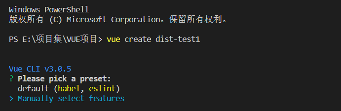

这里针对手动控制的各个配置选项做出解释：其中Router,vuex分别是指路由及vue状态管理器，可以在当前搭建时选取安装，也可以在搭建完成后手动安装，这里我们直接选中自动安装。

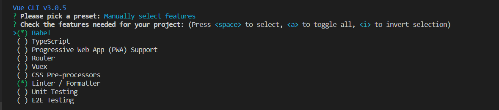

1.Pick a CSS pre-processor

选取一项CSS预编译类型，包括：Sass/SCSS;less;Stylus

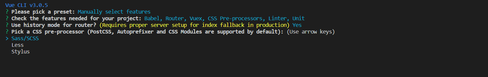

2.Pick a linter / formatter config

选取一项linter/formatter的自动化代码格式规范标准，这里我们选择ESLint + Prettier，配合vscode.

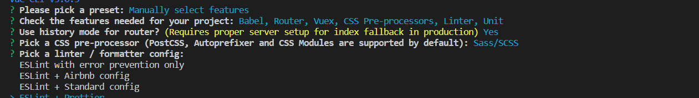

3.Pick additional lint features

选取是否保存当前的配置情况，第一个保存当前配置，下次创建新的项目就按当前的选择来，第二个则是每次手动配置都重新选取一次：

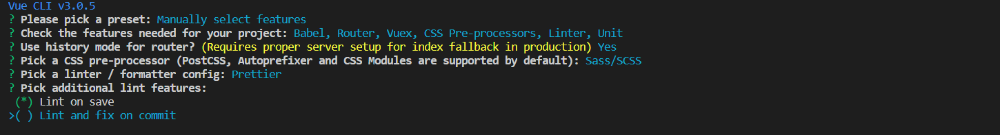

4.Pick a unit testing solution

这里是指选取一个单元测试的解决方案，这里可以自定义选择

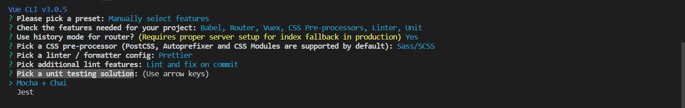

5.Where do you prefer placing config for Babel, PostCSS, ESLint, etc.?

这里是询问Babel,postCSS,ESLint等配置文件要如何放置，前者放置到一个单独的文件中，后者放置在package.json文件中，一般来说都选择放置到单独的文件中

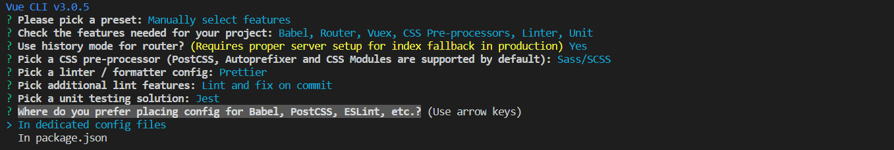

6.Save this as a preset for future projects?

是否保存当前的项目配置，若同意后续创建的项目配置将与此次配置一致

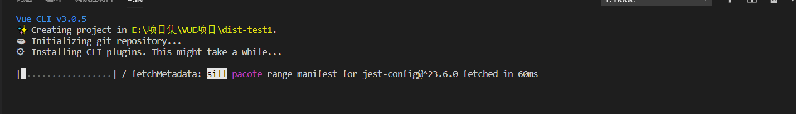

接下来将会是项目的自动创建阶段，可能需要等侯一段时间，当出现以下提示后环境搭建完成

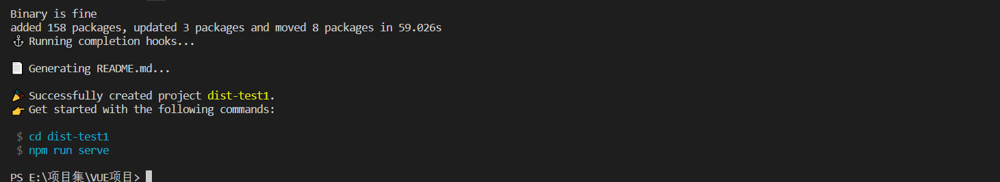

此时我们可以看到新搭建的vue项目目录如下：

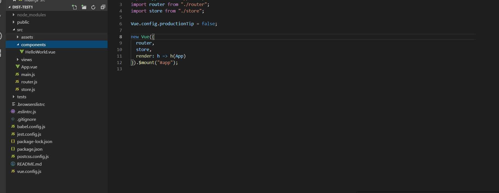

其实到这里项目已经可以启动了，在终端执行：

`npm run serve`

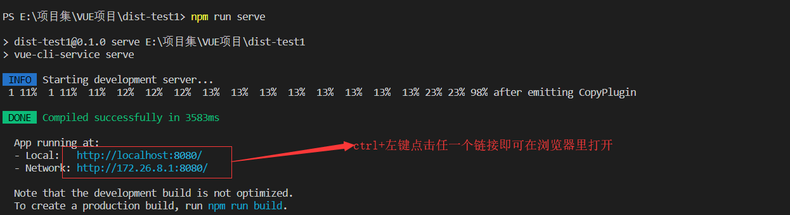

当我们在浏览器里看到如下页面，一个vue项目也就初步搭建成功了

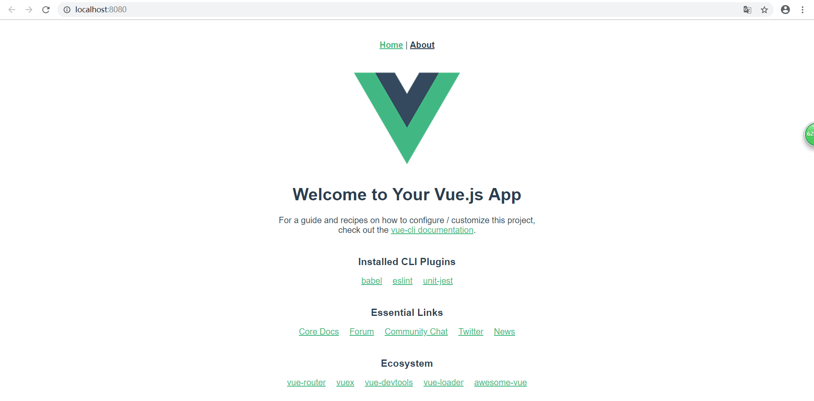

